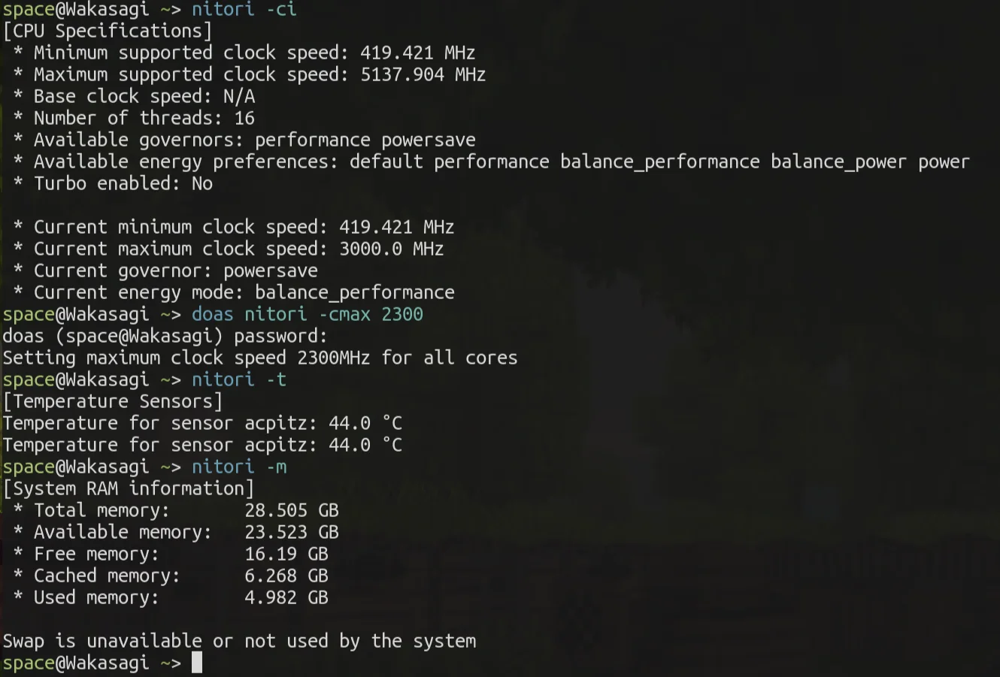

## Nitori
Nitori is a CLI tool for controlling and monitoring the system's CPU and hardware on Linux-based operating systems.
<div align="center">
    
</div>

### Supported features
* **CPU**: Montior hardware specifications and current configuration, set clock speeds, set kernel governor
* **Battery**: Set battery charge limit and monitor specifications, manufacturer, power usage and charge capabilities
* **Backlight**: Set and view the screen backlight brightness for built-in laptop screens
* **Suspension**: Suspend the system to RAM, freeze userspace or hibernate to disk
* **Memory**: Monitor the system memory and swap and now much is free, available, used and cached
* **Process**: List, count and find system processes and kernel threads
* **Temperature**: Montior the temperature of known hardware sensors

## Requirements
* Linux-based operating system
* Java 11 or newer

Nitori is only tested on x86_64 CPUs, but it should also work on other CPU architectures. Battery support and features might vary with different models. Nitori is currently Linux-only because it interacts with features specifically from the Linux kernel.

## Download

You can download Nitori from the [releases page](https://github.com/spacebanana420/nitori/releases).

You can run `java -jar nitori.jar` and open the help screen to see what you can do.

### Install on your system (using [Yuuka](https://github.com/spacebanana420/yuuka))
```
yuuka install nitori.jar
```

## Documentation

* [Build Nitori from source](doc/build.md)
* [Setting up presets](doc/presets.md)
* [Source code overview](doc/overview.md)
